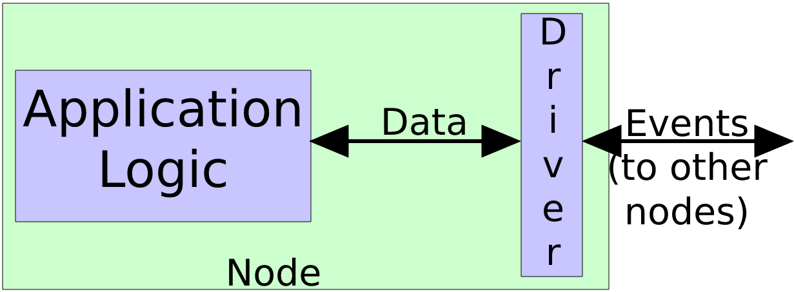

Preface
===

This is a minimum-worked example of a generic event-driven application. Its
point: to give some idea about what an event-driven application might look like
in the wild. Long story short:

- I introduce the concept of a node (we call 'stack' here), an event, and an
  event driver. I then explain how these might be implemented in software.

- The 'event-drivenness' of the application is divorced from the application
  logic. This means application developers can work independently, using some
  common event-driven infrastructure if desired.

This is not:

- A specification

- Well tested

- To be blindly trusted

It is simply an illustration. Mark expects it should take around 40 minutes to
get through if you are familiar with C programming.

Compilation
===

To compile this "the intended way", you will need a C89 compiler and make. Hit
the `all` target (i.e. `make all` in your prompt) to build everything
important. Come talk to Mark if you need help with this.

After compilation, you should have a bunch of object files, and the following
executables:

- `stack_demo`: See "Example Application Logic"

- `event_demo`: See "Events"

- `ebc_node_demo`: See "Putting it All Together"

It is not necessary, but I encourage you to follow along in the source and
executables as you read this document.

The System
===

An abridged view of an event-driven application is shown below.



- Application logic defines the core behaviours of the node - it could be
  responsible for executing some machine learning algorithm, for example. The
  application logic provides an interface: a set of functions that operate on
  some internal state. By separating the application logic from the other
  components of the event-driven system, the application can operate in a
  standalone manner.

- Events are nothing more than a series of bytes that are exchanged between
  drivers over some transport layer (e.g. IP, sockets, MPI).

- The driver acts as a communications broker between the node and the wider
  network. The driver receives events, interprets them to decide how to
  interact with the application logic (if at all), and may send events to other
  nodes (though this is not showcased in this example). The driver is
  (typically) quiescent, in that it only does any work when an event is
  received from another node.

- A node is the coupling between a driver and some application logic. Many
  nodes can be connected together in an event-driven system to complete a
  task. This example comes with `ebc_node_demo.c`, which defines an
  event-driven stack node using aforementioned stack and driver logic, and
  plays a series of events into the node.

What results is a system where nodes send events to each other, events are
processed by nodes, and (hopefully) some useful work is done.

Example Application Logic (Stack)
===

From the perspective of event-driven computing, the behaviours of a node don't
really matter beyond:

- The node may occasionally want to send events.

- The node will want to consume events, and alter its state accordingly.

That said, this example includes an exemplar set of application logic to
demonstrate this concept - `stack.{c,h}`. The corresponding translation unit
defines an integer stack as a simple struct containing an array `data` to hold
elements pushed to the stack, and a `head` index to store the location of the
top of the stack. The translation unit provides the following methods for
manipulating the stack:

- `void init(void)`: Defines the initial value for `head` (C89 does not let us
  define fields in the struct declaration).

- `int get_max(void)`: Returns the maximum capacity of the stack.

- `int peek(void)`: Returns the top-most value of the stack, or zero if the
  stack is empty (yuck, but 'tis only an example).

- `int pop(void)`: Returns the value from `int peek(void)`, and removes that
  value from the stack.

- `void push(const int)`: Places the value passed as argument to the top of the
  stack, and moves the head accordingly. If the stack is at capacity, simply
  overwrites the top-most value.

This stack itself is not particularly interesting or novel, but we will later
connect it to an event-driver. *Note that this implementation can be compiled
without any event-driven logic* - the stack functions completely
independently. To showcase this, a small demonstrator of stack functionality is
defined in the entry point of `stack_demo.c`, where a stack is initialised, and
values are pushed, peeked, and popped.

Events (what we're paid for)
===

As previously stated, an event is nothing more than a (finite) series of
bytes. Being programmers, we overlay a structure onto this series of bytes to
provide context. How one does this in the general event-driven computing sense
is entirely up to the programmer, but events usually contain:

- A header, which provides logistical information about the event (e.g. where
  it came from, when it was sent), and an opcode, which functions as a
  suggestion to the receiver about what to do with the event.

- Some payload, which is context-dependent.

- A tail, which contains a checksum and error reporting.

In this simple example, an event is a struct that contains these fields:

- `unsigned char instruction`: Our "opcode"

- `unsigned char payload[4]`: Our payload, constrained to four bytes.

The choice of `char` here is arbitrary - any byte-length type would work just
the same way. *There's nothing sacred about this definition* - you could vary
this however you like. You could even have variable-length payload if you want
to.

> As an aside which you may want to come back to:
>
> If we wanted to turn our stack example into an event-driven node, we might
> consider it to have:
>
>  - one input channel that holds a "request" for the stack (i.e. peek, pop,
>    and push with a value.
>  - one output channel, to which popped and peeked values go.
>
> ...though there are many ways to slice this. In this particular example, we
> don't send events out, and instead simply print to screen (to make this whole
> thing easier to follow.
>
> We could map our five functions defined in the "Example Application Logic"
> section to five different char values in our `instruction` field. This is
> what the `ebc_node_demo.c` translation unit does, but again, there are many
> ways to slice this.

The translation unit compiled from `event.{c,h}` defines some convenience
methods:

- `int payload_to_int(const unsigned char*)`: Converts a payload passed as
  argument to an integer, brazenly assuming that integers are four bytes long
  in your computer.

- `void print_event(const struct Event*)`: Offers a pretty-print of an event
  structure.

- `void serialise(const struct Event*, unsigned char* const)`: Writes the
  content of the event passed as the first argument, to the array in the second
  argument. The second argument must have a length of at least five (to fit the
  entirety of the event).

- `void deserialise(struct Event* const, const unsigned char*)`: The reverse of
  the above.

The entry point in `event_demo.c` showcases these methods, by constructing an
event and printing it in different ways. *Note that `event_demo` is compiled
without any node or driver logic*.

The Driver (because someone has to)
===

Now we have defined what an event is, and the behaviour of a node (our stack
example), we are ready to create an application node by incorporating a
driver. A driver accepts incoming events, and executes functions depending on
what it receives.

In terms of data, a driver is a glorified map between the instruction field of
an event, and the functions that it executes. The driver doesn't define any
node logic - the driver simply "drives" the behaviour of the node. This
`driverMap` is declared in `driver.c` as:

```
int (*driverMap[DRIVER_MAP_SIZE])(const unsigned char* payload);
```

Since we're working in C89, and our instruction field is defined by a character
(i.e. a byte), we initialise an array of size "byte" (`DRIVER_MAP_SIZE` is
equal to 256), and use that array to store function pointers to execute. These
function pointers accept an argument of `unsigned char* payload`, and are
responsible for manipulating the payload into a form that the application logic
can recognise (see "Putting it All Together").

Implementing this in C++, you would likely consider a std::map, in Python a
dictionary, in Lua a table, and so on.

The driver has two related methods, defined in `driver.c`:

- `void reg(const unsigned key, int (*const cb)(const unsigned char*))`: Adds
  an entry to the driver map in element `key`, corresponding to the function
  pointer `cb` (short for call-back). Overwrites if a function pointer is
  already defined for that key.

- `int consume (int* const out, const struct Event* event)`: Reads the
  `instruction` field from an incoming event - if that corresponds to an entry
  in the driver map, then call that function passing the event payload as an
  argument. The return value of that function is written to `out`, and
  `consume` itself returns 0. If the instruction field does not have a
  corresponding entry in the driver map, `consume` screams loudly and returns
  1.

To use this driver, one first registers callback functions with the
driver. Once these functions have been registered, consumed events then call
these functions and in so doing, interact with application logic.

For the avoidance of doubt, the `driver.{c,h}` translation unit knows nothing
about stacks, though it does know something about events (since it needs to
consume them).

> Another aside:
>
> This example is written without any dynamic memory allocation whatsoever,
> purely because I wanted to see if I could. If you wanted to support
> variable-length events, you would need extra logic to allocate memory to
> store the contents of the byte stream in an event instance, and the driver
> would be responsible for freeing this memory after the event is consumed. I
> add a NB to `driver.c` to indicate where one might do this.

Putting it All Together
===

The previous sections have defined everything shown in "The System":

- "Application Logic" is defined by our stack.

- "Driver" has been covered in some detail.

- We now know that "Events" are nothing more than series (plural) of bytes.

- "Data" is transferred from the driver by the payload argument in the callback
  function, and to the driver by the return value `out`.

We now have sufficient material to introduce an example where a driver controls
a stack using events (`ebc_node_demo.c`). This example defines some callback
functions and an entry point.

Callback Functions
---

The callback functions defined in this example accept an event payload, call
some application logic, and return a sensible value. Functionally, they are
wrappers around individual application logic functions. In a general
event-driven compute context, callback functions can be more complicated and
may even send events themselves.

These callback functions are:

- `int initialise_cb(const unsigned char* payload)`: Calls the `void
  init(void)` stack function, and returns 0. Payload is ignored.

- `int get_max_cb(const unsigned char* payload)`: Calls the `int get_max(void)`
  stack function and returns the value. Payload is ignored.

- `int peek_cb(const unsigned char* payload)`: As above, for `int peek(void)`.

- `int pop_cb(const unsigned char* payload)`: As above, for `int pop(void)`.

- `int push_cb(const unsigned char* payload)`: Pushes the value from the event
  payload onto the stack using the `void push(const int)` stack function, and
  returns 0.

Each of these callback functions prints to screen, to make the path of
execution easier to follow when running the demo (and I highly recommend you do
run it!) Note that only the push callback function uses the payload, because it
is the only piece of application logic that requires an input.

Entry Point
---

The entry point creates a sequence of events to feed into the driver
(accepting that this is a simple example - we could create another node to send
events to this one if we really wanted to). In this example, the events are
(in sequence):

instruction|payload
---|---
0|0
1|0
4|125
4|65281
3|0
2|0
3|0
3|0
16|0

The entry point is also responsible for registering each of the callback
functions into the driver map; each to a different instruction:

instruction|callback
---|---
0|`initialise_cb`
1|`get_max_cb`
2|`peek_cb`
3|`pop_cb`
4|`push_cb`

Hence we expect the following behaviour, when each of these events is consumed
in sequence:

1. The stack is initialised

2. We obtain the maximum value of the stack printed to screen (it's 10 by
   default).

3. We push value 125.

4. We push value 65281.

5. We pop the value 65281.

6. We peek the value 125.

7. We pop the value 125.

8. We pop the value 0 (because the stack is empty).

9. We attempt to call the function mapped to 16 in the driver map, but no such
   function is defined. The driver's `consume` function screams loudly, and the
   entrypoint exits.

Lo and behold it all works as Mark ordained. (if it doesn't, please tell me!).

> As an exercise to the reader, I invite you to try your hand:
>
>  - Add a stack function to peek at an arbitrary location of the stack,
>    defined by an argument.
>
>  - Create a callback function and hook it up to this example by inserting an
>    appropriate event into `ebc_node_demo.c`.
>
>  - See if it works (it should!).

So What?
===

In summary, we have learned:

- How one might go about putting together an event-driven application.

- That an event is nothing more than a series of bytes, though a programmer can
  overlay some meaning onto an event to make it easier to work with.

- How a driver might consume events, and how it might call application logic
  depending on the content of the event (the `instruction` field in our
  example).

- One can "attach" an event-driven computing framework onto an application, if
  it has been written sympathetically.

There are many practical concepts this example does not cover, including
driving an application in parallel (e.g. using threads), managing
arbitrary-length events, incorporating checksums or encryption in event tails,
and the interaction between multiple nodes. If there is sufficient demand for
these I'll happily put a more complex example together (time permitting!). Of
course, you are more than welcome to do it yourself, as you now have the tools
to do so.

Cheers,

-- Mark Vousden
